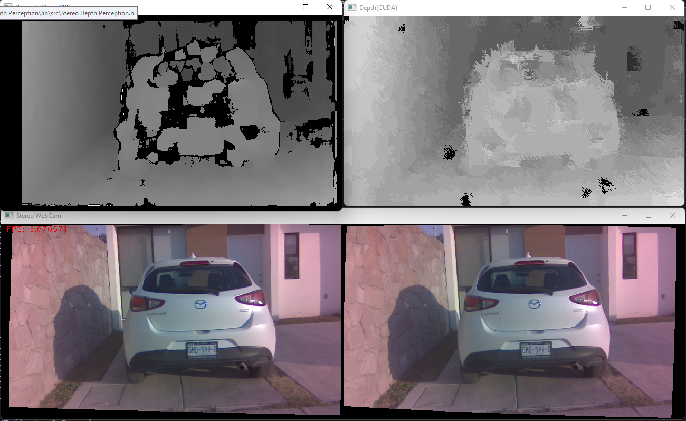

# Stereo Depth Perception - CUDA

Computer stereo vision is the process of extracting three-dimensional information from digital images
by calculating depth based on the binocular discrepancy between the left and right camera images of
an object. In stereo vision, two cameras located on the same horizontal line are displaced relative to
each other, which allow you to get one image from two points, this works similarly to the binocular
vision of a person.

Analysis of these two images allows obtaining disparity map information. A
disparity map is an indicator of the difference in the relative position of the same points recorded by
two cameras. This map allows us to calculate the difference in horizontal coordinates of the
corresponding points of the image, which ultimately will allow us to calculate the distance to the
object.



## Requirements

### - OS: Windows or Linux.

### - OpenCV 4+.

### - CUDA capable GPU.

### - Dataset _(Provided)_ or Stereo Camera.

## Wrapper

```cpp
#include <opencv2/opencv.hpp>
#include <opencv2/imgcodecs.hpp>

namespace StereoDepthPerceptionLib
{
    // Call this once.
    // Size = Size(width, height)
	void Setup(const cv::Size size);

    // Call this every frame.
	void Compute(
		const cv::Mat &leftImage,
		const cv::Mat &rightImage);

    // Call this every frame.
	void GetDepthImage(cv::Mat &depthImage);
}
```

## Demo

**1. Create the build folder.**

```command
    mkdir build && cd build
```

**2. Cmake and make.**

```command
    cmake .. && make
```

**3. Run the demo.**

```command
    ./StereoDepthPerception
```
